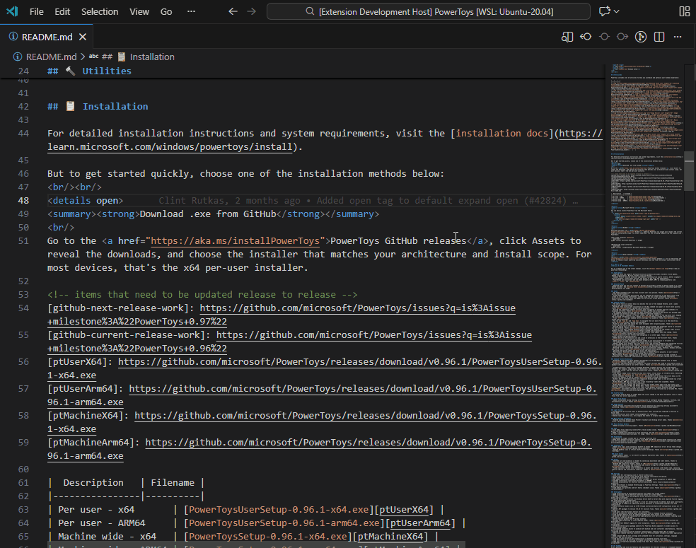

# Git Spotlight

A VS Code extension that visualizes Git blame information with intelligent line highlighting. Spot changes by age, author, commit, or heatmap with ease.



## Features

### 🕐 Highlight by Age
Highlight lines modified within a specified time duration.
- Command: `Git Spotlight: Highlight by Age`
- Enter duration: `7d`, `30d`, `3m`, `1y`, or ISO date

### 👤 Highlight by Author
Color-code lines by author - each author gets a unique, consistent color.
- Command: `Git Spotlight: Highlight All Authors`

### 📝 Highlight by Commit
Color-code lines by commit - each commit gets a unique color.
- Command: `Git Spotlight: Highlight All Commits`

### 🎯 Highlight Specific Author
Select and highlight only a specific author's changes.
- Command: `Git Spotlight: Highlight Specific Author`

### 🔍 Highlight Specific Commit
Select and highlight only a specific commit's changes.
- Command: `Git Spotlight: Highlight Specific Commit`

### 🔥 Heatmap Mode (NEW in v3.0)
Visualize code age with a gradient heatmap - newer code appears in warmer colors, older code in cooler colors.
- Command: `Git Spotlight: Heatmap Mode`
- 20-level color gradient from blue (oldest) to teal (newest)
- Great for identifying recently modified vs. stable code

###  File Statistics (NEW in v3.0)
View detailed statistics about file contributors, commits, and activity.
- Command: `Git Spotlight: Show File Statistics`
- Author contribution breakdown with percentages
- Recent commits list
- Activity timeline for the last 30 days

### 🔤 Gutter Annotations (NEW in v3.0)
Show author initials or indicators in the editor gutter alongside highlighting.
- Command: `Git Spotlight: Toggle Gutter Annotations`
- Modes: Author initials, colored dots, or age indicators
- Works alongside any highlight mode

### 🧭 Navigation
Navigate between highlighted lines with keyboard shortcuts.
- `Alt+]` - Go to next highlight
- `Alt+[` - Go to previous highlight
- Status bar buttons available when highlights are active

### ✨ Additional Features
- **Uncommitted Changes**: Optionally highlight uncommitted lines with a red underline
- **Hover Information**: View author, date, and commit message on hover
- **Status Bar**: Shows current mode, click to clear
- **Auto Refresh**: Updates on file save and branch switch
- **Overview Ruler**: See highlights in the scrollbar/minimap area
- **Performance Optimized**: Debounced execution, caching, file size limits

## Installation

### From VSIX
```bash
code --install-extension git-spotlight-3.0.0.vsix
```

### From Source
```bash
cd GitAgeHighlighter
npm install
npm run compile
# Press F5 in VS Code to debug
```

## Usage

1. Open a file that's tracked by Git
2. Open Command Palette (`Ctrl+Shift+P` / `Cmd+Shift+P`)
3. Type "Git Spotlight" to see available commands
4. Select a highlighting mode
5. Click the status bar item or run `Git Spotlight: Clear All Highlights` to clear

## Commands

| Command | Description | Shortcut |
|---------|-------------|----------|
| `Git Spotlight: Highlight by Age` | Highlight recently modified lines | |
| `Git Spotlight: Highlight All Authors` | Color-code by author | |
| `Git Spotlight: Highlight All Commits` | Color-code by commit | |
| `Git Spotlight: Highlight Specific Author` | Highlight one author's changes | |
| `Git Spotlight: Highlight Specific Commit` | Highlight one commit's changes | |
| `Git Spotlight: Heatmap Mode` | Gradient by code age | |
| `Git Spotlight: Show File Statistics` | Show contributor stats panel | |
| `Git Spotlight: Toggle Gutter Annotations` | Toggle gutter initials/dots | |
| `Git Spotlight: Go to Next Highlight` | Navigate to next highlight | `Alt+]` |
| `Git Spotlight: Go to Previous Highlight` | Navigate to previous highlight | `Alt+[` |
| `Git Spotlight: Clear All Highlights` | Remove all highlights | |

## Configuration

| Setting | Type | Default | Description |
|---------|------|---------|-------------|
| `gitSpotlight.duration` | string | `"30d"` | Default duration for age highlighting |
| `gitSpotlight.enableUncommittedHighlight` | boolean | `true` | Show uncommitted lines |
| `gitSpotlight.enableGutterAnnotations` | boolean | `false` | Show author initials in gutter |
| `gitSpotlight.gutterDisplayMode` | string | `"initials"` | Gutter mode: `initials`, `dot`, or `age` |
| `gitSpotlight.enhancedMinimapColors` | boolean | `true` | Enhanced overview ruler visibility |
| `gitSpotlight.maxFileSizeKB` | number | `1024` | Max file size to process |
| `gitSpotlight.ageHighlightColor` | string | `"rgba(70,130,180,0.3)"` | Age highlight color |
| `gitSpotlight.uncommittedHighlightColor` | string | `"rgba(180,80,80,0.25)"` | Uncommitted background |
| `gitSpotlight.uncommittedUnderlineColor` | string | `"rgba(180,80,80,0.6)"` | Uncommitted underline |
| `gitSpotlight.selectedHighlightColor` | string | `"rgba(64,224,208,0.3)"` | Selected author/commit color |
| `gitSpotlight.colorSaturation` | number | `55` | Auto color saturation (0-100) |
| `gitSpotlight.colorLightness` | number | `45` | Auto color lightness (0-100) |
| `gitSpotlight.colorOpacity` | number | `0.28` | Auto color opacity (0-1) |
| `gitSpotlight.gitTimeout` | number | `5000` | Git command timeout (ms) |
| `gitSpotlight.debounceDelay` | number | `300` | Debounce delay (ms) |

## Duration Formats

- `7d` - 7 days
- `2w` - 2 weeks
- `3m` - 3 months (30 days each)
- `1y` - 1 year
- `2024-01-15` - ISO date
- `2024-01-15T10:30:00Z` - ISO datetime

## Architecture

```
src/
├── extension.ts          # Main entry, commands, state management
├── blame/
│   ├── gitRunner.ts      # Safe git command execution
│   ├── blameParser.ts    # Parses git blame output
│   └── blameCache.ts     # Caches blame by (file, HEAD)
├── highlight/
│   ├── decorator.ts      # Multi-mode decoration manager
│   ├── gutterDecorator.ts # Gutter annotation manager
│   ├── heatmap.ts        # Heatmap color calculations
│   └── styles.ts         # Decoration style definitions
├── views/
│   └── fileStatistics.ts # Statistics webview panel
├── config/
│   └── settings.ts       # Type-safe configuration
└── utils/
    ├── colorGenerator.ts # Consistent color generation
    ├── debounce.ts       # Debounce utility
    ├── fileUtils.ts      # File validation
    └── timeParser.ts     # Duration parsing
```

## What's New in v3.0

- **Heatmap Mode**: Gradient colors showing code age at a glance
- **File Statistics Panel**: Detailed contributor and commit statistics
- **Gutter Annotations**: Author initials alongside line highlighting
- **Enhanced Navigation**: Status bar buttons with highlight count
- **Improved Colors**: Cool blue/teal palette for better visibility

## Requirements

- VS Code 1.85.0+
- Git installed and in PATH
- File must be tracked by Git

## License

MIT

## Contributing

Contributions welcome! Please open issues and pull requests on GitHub.
